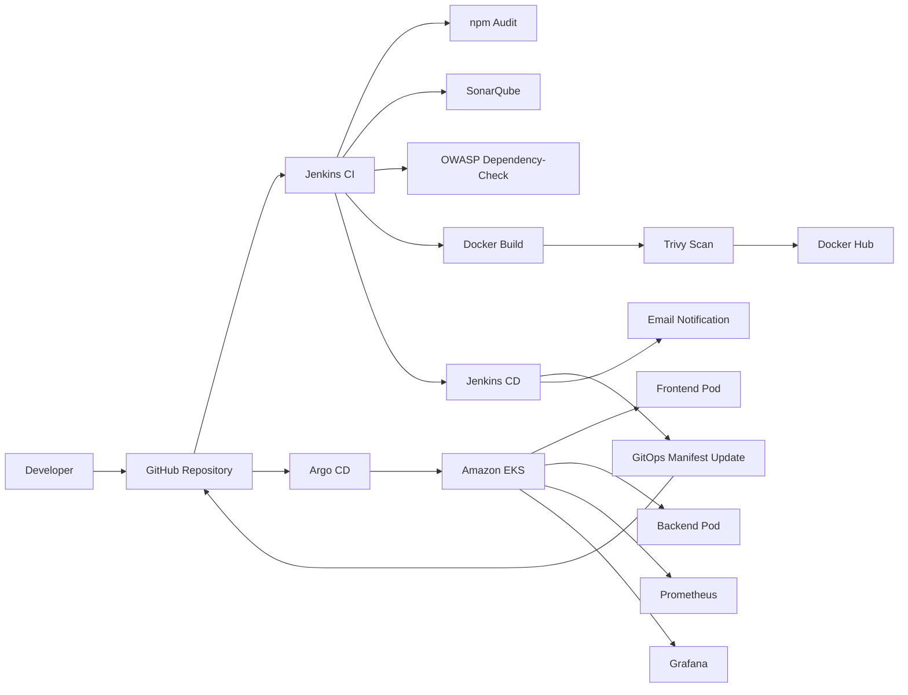

# Multi-Region AWS Resource Dashboard

A complete end-to-end **Cloud and DevOps project** that discovers AWS resources across multiple regions and presents them in a centralized dashboard.

The project includes:

- React and Vite frontend
- Node.js and Express backend
- Dockerized application services
- Jenkins CI/CD pipelines
- SonarQube code-quality analysis
- OWASP Dependency-Check
- Trivy image scanning
- Docker Hub image publishing
- Amazon EKS deployment
- Kustomize-based Kubernetes manifests
- Argo CD GitOps deployment
- Prometheus and Grafana monitoring
- Jenkins email notifications
- Automated cleanup guidance to control AWS cost

> This repository demonstrates a complete workflow from source-code checkout to automated security scanning, container publishing, GitOps deployment, monitoring, and email notification.

---

## Table of Contents

1. [Project Overview](#project-overview)
2. [Features](#features)
3. [Architecture](#architecture)
4. [CI/CD Workflow](#cicd-workflow)
5. [Technology Stack](#technology-stack)
6. [Repository Structure](#repository-structure)
7. [Application Services](#application-services)
8. [Prerequisites](#prerequisites)
9. [AWS Cost Warning](#aws-cost-warning)
10. [Local Development](#local-development)
11. [Docker Setup](#docker-setup)
12. [Jenkins Infrastructure](#jenkins-infrastructure)
13. [Jenkins Agent Tools](#jenkins-agent-tools)
14. [SonarQube Setup](#sonarqube-setup)
15. [Jenkins Credentials](#jenkins-credentials)
16. [Jenkins CI Job](#jenkins-ci-job)
17. [Amazon EKS Setup](#amazon-eks-setup)
18. [EKS Security Group Rules](#eks-security-group-rules)
19. [Argo CD Installation](#argo-cd-installation)
20. [Argo CD Application](#argo-cd-application)
21. [Jenkins CD Job](#jenkins-cd-job)
22. [Running the Complete CI/CD Pipeline](#running-the-complete-cicd-pipeline)
23. [Prometheus and Grafana](#prometheus-and-grafana)
24. [Access URLs](#access-urls)
25. [Verification Commands](#verification-commands)
26. [Email Notification Setup](#email-notification-setup)
27. [Security Best Practices](#security-best-practices)
28. [Troubleshooting](#troubleshooting)
29. [Cleanup and Cost Control](#cleanup-and-cost-control)
30. [Project Outcomes](#project-outcomes)
31. [Future Improvements](#future-improvements)

---

## Project Overview

The Multi-Region AWS Resource Dashboard provides a single interface for viewing AWS resources distributed across different AWS regions and Availability Zones.

The backend uses the AWS SDK to query AWS APIs. The frontend consumes the backend REST API and displays the collected information in a browser-based dashboard.

The application is deployed through a complete DevSecOps workflow:

```text
GitHub
  |
  v
Jenkins CI
  |
  +--> Frontend and backend validation
  +--> npm audit
  +--> SonarQube
  +--> OWASP Dependency-Check
  +--> Docker image build
  +--> Trivy scan
  +--> Docker Hub push
  |
  v
Jenkins CD
  |
  +--> Configure EKS access
  +--> Create/update Kubernetes AWS Secret
  +--> Update Kustomize image tags
  +--> Validate Kubernetes manifests
  +--> Commit and push GitOps changes
  |
  v
Argo CD
  |
  v
Amazon EKS
  |
  +--> Frontend
  +--> Backend
  +--> Prometheus
  +--> Grafana
```

---

## Features

- Discovers AWS resources across multiple regions.
- Displays regional and global AWS service information.
- Uses a React-based responsive frontend.
- Uses a Node.js and Express REST API backend.
- Supports Docker Compose for local development.
- Uses Jenkins declarative pipelines.
- Creates immutable Docker image tags.
- Publishes frontend and backend images to Docker Hub.
- Runs SonarQube code-quality checks.
- Runs OWASP Dependency-Check for known dependency vulnerabilities.
- Runs Trivy scans against built container images.
- Deploys to Amazon EKS using Kubernetes manifests.
- Uses Kustomize overlays for production configuration.
- Uses Argo CD for GitOps synchronization.
- Installs Prometheus and Grafana inside EKS.
- Exposes demo services using Kubernetes NodePort.
- Sends Jenkins success and failure email notifications.
- Attaches a deployment summary and console log to CD emails.

---

## Architecture



### Infrastructure Layout

```text
Jenkins Controller EC2
├── Jenkins web interface
└── CI/CD job orchestration

Jenkins Agent EC2
├── Jenkins agent runtime
├── Docker
├── SonarQube
├── AWS CLI
├── eksctl
├── kubectl
├── Helm
├── Kustomize
├── Trivy
└── OWASP Dependency-Check cache

Amazon EKS
├── Argo CD
├── Frontend deployment
├── Backend deployment
├── Prometheus
├── Grafana
├── kube-state-metrics
└── node-exporter
```

> Commands are executed from the Jenkins agent EC2 instance, but Kubernetes applications run on the EKS worker nodes.

---

## CI/CD Workflow

### Continuous Integration

The `MRD-CI` Jenkins job performs:

1. Clean Jenkins workspace.
2. Checkout code from GitHub.
3. Generate an immutable image tag.
4. Validate required tools.
5. Install frontend dependencies.
6. Run frontend audit, lint, and build.
7. Install backend dependencies.
8. Run backend audit.
9. Run backend JavaScript syntax checks.
10. Run SonarQube analysis.
11. Wait for SonarQube Quality Gate.
12. Run OWASP Dependency-Check.
13. Validate Docker Compose configuration.
14. Validate Kubernetes manifests using Kustomize.
15. Build frontend and backend Docker images.
16. Scan images using Trivy.
17. Log in to Docker Hub.
18. Push versioned and `latest` images.
19. Optionally trigger `MRD-CD`.

### Continuous Deployment

The `MRD-CD` Jenkins job performs:

1. Validate the supplied image tag.
2. Configure AWS credentials.
3. Update the EKS kubeconfig.
4. Verify Kubernetes connectivity.
5. Create or update the `aws-secret` Kubernetes Secret.
6. Update production Kustomize image tags.
7. Render and validate Kubernetes manifests.
8. Commit the new image tags to GitHub.
9. Allow Argo CD to detect and synchronize the Git change.
10. Send success or failure email notification.
11. Attach `deployment-summary.txt`.
12. Attach the full Jenkins build log.

### Image Tag Format

```text
<JENKINS_BUILD_NUMBER>-<8_CHARACTER_GIT_COMMIT>
```

Example:

```text
23-623772c7
```

This makes every deployment traceable to a Jenkins build and Git commit.

---

## Technology Stack

### Frontend

- React
- Vite
- JavaScript
- HTML
- CSS
- Nginx

### Backend

- Node.js
- Express
- AWS SDK
- REST APIs

### DevOps and Cloud

- Git and GitHub
- Jenkins
- Docker and Docker Compose
- Docker Hub
- SonarQube and SonarScanner
- OWASP Dependency-Check
- Trivy
- Amazon EC2 and Amazon EKS
- AWS CLI and eksctl
- Kubernetes and kubectl
- Kustomize
- Argo CD
- Helm
- Prometheus
- Grafana

### Tested Environment

```text
Ubuntu:                  24.04
Node.js:                 24.x
npm:                     11.x
Docker Engine:           29.x
Docker Compose:          2.x
kubectl:                 1.35.x
Amazon EKS:              Kubernetes 1.35
Kustomize:               5.x
Trivy:                   0.72.x
OWASP Dependency-Check:  12.x
SonarScanner CLI:        8.x
```

Exact versions may be upgraded over time.

---

## Repository Structure

```text
multi-region-dashboard/
├── argocd/
│   ├── dashboard-application.yaml
│   └── argocd-server-nodeport.yaml
├── backend/
│   ├── src/
│   │   ├── app.js
│   │   ├── middleware/cache.js
│   │   ├── routes/dashboard.js
│   │   └── services/awsServices.js
│   ├── Dockerfile
│   ├── package.json
│   └── package-lock.json
├── eks/
│   └── cluster.yaml
├── frontend/
│   ├── src/
│   ├── nginx.conf
│   ├── Dockerfile
│   ├── package.json
│   └── package-lock.json
├── gitops/
│   └── Jenkins-CD
├── k8s/
│   ├── base/
│   │   ├── namespace.yaml
│   │   ├── backend-deployment.yaml
│   │   ├── backend-service.yaml
│   │   ├── frontend-deployment.yaml
│   │   ├── frontend-service.yaml
│   │   └── kustomization.yaml
│   └── overlays/production/kustomization.yaml
├── monitoring/
│   └── kube-prometheus-stack-values.yaml
├── scripts/
│   ├── preflight-check.sh
│   ├── install-argocd.sh
│   ├── install-monitoring.sh
│   ├── allow-nodeports.sh
│   ├── show-access.sh
│   └── delete-cluster.sh
├── terraform/
├── docker-compose.yml
├── Jenkins-CI
└── README.md
```

---

## Application Services

The backend exposes APIs such as:

```text
GET /api/regions
GET /api/region/:region
GET /api/global
GET /api/all
```

The frontend uses `/api` requests, which Nginx proxies to:

```text
aws-dashboard-backend-service:4000
```

The backend queries AWS APIs using credentials provided through a Kubernetes Secret.

> Never hard-code AWS access keys in source code, Docker images, Kubernetes manifests, or Git.

---

## Prerequisites

### Accounts

- AWS account
- GitHub account
- Docker Hub account
- Gmail account with 2-Step Verification enabled

### Infrastructure

- Jenkins controller EC2
- Jenkins agent EC2
- GitHub repository
- Docker Hub repositories

### Jenkins Plugins

- Pipeline
- Git and GitHub
- Credentials Binding
- SSH Build Agents
- Docker Pipeline
- NodeJS
- SonarQube Scanner
- OWASP Dependency-Check
- Email Extension
- AWS Credentials
- Pipeline Utility Steps

### AWS Services

- IAM
- EC2
- EKS
- VPC
- CloudFormation
- Auto Scaling
- EBS
- Public IPv4 addresses

---

## AWS Cost Warning

This project creates billable resources:

- EKS control plane
- EC2 worker nodes
- Jenkins EC2 instances
- EBS volumes
- Public IPv4 addresses
- Data transfer
- Optional load balancers or NAT gateways

The example EKS configuration disables the NAT gateway and uses public workers for a lower-cost demonstration.

> Delete EKS immediately after screenshots and testing. Do not manually stop managed worker nodes because Auto Scaling may replace them.

---

## Local Development

### Clone

```bash
git clone https://github.com/AadityaSharma996/multi-region-dashboard.git
cd multi-region-dashboard
```

### Backend

```bash
cd backend
npm ci
npm start
```

Default backend URL:

```text
http://localhost:4000
```

### Frontend

```bash
cd frontend
npm ci
npm run dev
```

### Development Environment Variables

```bash
export AWS_ACCESS_KEY_ID="<your-access-key-id>"
export AWS_SECRET_ACCESS_KEY="<your-secret-access-key>"
export AWS_DEFAULT_REGION="us-east-1"
export PORT="4000"
```

Use Jenkins credentials and Kubernetes Secrets in production.

---

## Docker Setup

### Docker Hub Repositories

```text
aadityasharma96/multi-region-dashboard-backend
aadityasharma96/multi-region-dashboard-frontend
```

### Build Manually

```bash
docker build   -t aadityasharma96/multi-region-dashboard-backend:local   backend

docker build   -t aadityasharma96/multi-region-dashboard-frontend:local   frontend
```

### Docker Compose

```bash
docker compose config
docker compose up --build
```

Stop:

```bash
docker compose down
```

### Backend Container Security

Use a non-root user, production-only dependencies, and a patched npm version:

```dockerfile
FROM node:24-alpine

RUN npm install --global npm@latest     && npm cache clean --force

WORKDIR /app

COPY package.json package-lock.json ./
RUN npm ci --omit=dev

COPY --chown=node:node . .

ENV NODE_ENV=production
ENV PORT=4000

USER node

EXPOSE 4000

CMD ["npm", "start"]
```

Pin exact versions for reproducible production builds.

---

## Jenkins Infrastructure

### Controller EC2

Typical inbound rules:

```text
TCP 22    Source: My IP
TCP 8080  Source: My IP
```

Enable Jenkins:

```bash
sudo systemctl enable jenkins
sudo systemctl start jenkins
sudo systemctl status jenkins
```

### Agent EC2

The project uses a separate Jenkins agent. A `t3.large` was used because Docker builds, SonarQube, OWASP, and Kubernetes tooling require memory.

Enable Docker:

```bash
sudo systemctl enable docker
sudo systemctl start docker
sudo usermod -aG docker ubuntu
```

Reconnect after adding the user to the Docker group.

Agent label:

```text
adi
```

### Executor Deadlock Prevention

When CI waits for CD and both use the same agent, configure two executors:

```text
Manage Jenkins
→ Nodes
→ Agent-adi
→ Configure
→ Number of executors: 2
```

A better permanent approach is asynchronous CD:

```groovy
build job: 'MRD-CD',
    parameters: [
        string(name: 'IMAGE_TAG', value: env.IMAGE_TAG)
    ],
    wait: false,
    propagate: false
```

---

## Jenkins Agent Tools

Verify:

```bash
git --version
docker --version
docker compose version
docker buildx version
aws --version
kubectl version --client
eksctl version
kustomize version
helm version
trivy --version
```

Jenkins tool names used:

```text
NodeJS-24
SonarScanner
OWASP-Dependency-Check
```

Persistent scanner caches:

```text
/home/ubuntu/.cache/trivy
/home/ubuntu/.cache/dependency-check
```

---

## SonarQube Setup

Run SonarQube on the Jenkins agent:

```bash
docker run -d   --name SonarQube-Server   --restart unless-stopped   -p 9000:9000   sonarqube:lts-community
```

Verify:

```bash
docker ps --filter name=SonarQube-Server
curl http://127.0.0.1:9000/api/system/status
```

Expected:

```json
{"status":"UP"}
```

Configure Jenkins:

```text
Manage Jenkins
→ System
→ SonarQube installations

Name: SonarQube-Server
Server URL: http://<JENKINS_AGENT_PRIVATE_IP>:9000
Authentication token: sonarqube-token
```

Use the agent private IP, not its changing public IP.

Configure SonarQube webhook:

```text
http://<JENKINS_CONTROLLER_PRIVATE_IP>:8080/sonarqube-webhook/
```

---

## Jenkins Credentials

Create under:

```text
Manage Jenkins
→ Credentials
→ System
→ Global credentials
```

### Docker Hub

```text
ID: dockerHubCred
Kind: Username with password
```

### GitHub

```text
ID: github-credentials
Kind: Username with password
Password: GitHub Personal Access Token
```

### AWS

```text
ID: aws-secret
Kind: AWS Credentials
```

Correct pipeline binding:

```groovy
withCredentials([[
    $class: 'AmazonWebServicesCredentialsBinding',
    credentialsId: 'aws-secret',
    accessKeyVariable: 'AWS_ACCESS_KEY_ID',
    secretKeyVariable: 'AWS_SECRET_ACCESS_KEY'
]]) {
    // AWS commands
}
```

### SonarQube

```text
ID: sonarqube-token
Kind: Secret text
```

### NVD

```text
ID: nvd-api-key
Kind: Secret text
```

---

## Jenkins CI Job

Create:

```text
Job name: MRD-CI
Definition: Pipeline script from SCM
SCM: Git
Repository:
https://github.com/AadityaSharma996/multi-region-dashboard.git
Credentials: github-credentials
Branch: */main
Script Path: Jenkins-CI
```

Parameter:

```text
RUN_CD
```

- `false`: CI only
- `true`: CI and CD

CI runs:

- Frontend lint/build/audit
- Backend audit/syntax checks
- SonarQube analysis and Quality Gate
- OWASP Dependency-Check
- Docker Compose validation
- Kustomize validation
- Docker builds
- Trivy scans
- Docker Hub push
- Optional CD trigger

---

## Amazon EKS Setup

Example `eks/cluster.yaml`:

```yaml
apiVersion: eksctl.io/v1alpha5
kind: ClusterConfig

metadata:
  name: multi-region-dashboard
  region: us-east-1
  version: "1.35"

iam:
  withOIDC: true

vpc:
  nat:
    gateway: Disable

  clusterEndpoints:
    publicAccess: true
    privateAccess: true

managedNodeGroups:
  - name: dashboard-node-group
    instanceType: t3.large
    minSize: 2
    desiredCapacity: 2
    maxSize: 2
    volumeSize: 30
    privateNetworking: false

    labels:
      workload: dashboard

    tags:
      project: multi-region-dashboard
```

For a cheaper demo:

```yaml
minSize: 1
desiredCapacity: 1
maxSize: 2
```

### Check vCPU Quota

```bash
aws service-quotas get-service-quota   --service-code ec2   --quota-code L-1216C47A   --region us-east-1   --query 'Quota.Value'   --output text
```

### Preflight

```bash
cd ~/multi-region-dashboard

git status
aws sts get-caller-identity
kubectl version --client
eksctl version
kustomize version
helm version
./scripts/preflight-check.sh
```

### Create

```bash
eksctl create cluster -f eks/cluster.yaml
```

### Configure kubectl

```bash
aws eks update-kubeconfig   --name multi-region-dashboard   --region us-east-1
```

### Verify

```bash
kubectl cluster-info

kubectl wait   --for=condition=Ready   nodes   --all   --timeout=15m

kubectl get nodes -o wide
```

---

## EKS Security Group Rules

NodePorts:

| Port | Service | Recommended Source |
|---:|---|---|
| 30080 | Dashboard | My IP, or temporary public demo |
| 30443 | Argo CD | My IP |
| 30030 | Grafana | My IP |
| 30090 | Prometheus | My IP |

Use the laptop's public IP for browser access.

Do not use the Jenkins agent's public IP as the browser source unless the agent itself requires access.

---

## Argo CD Installation

Commands run from the Jenkins agent, but Argo CD runs inside EKS.

```bash
kubectl create namespace argocd   --dry-run=client   -o yaml |
kubectl apply -f -
```

Install a tested release:

```bash
export ARGOCD_VERSION="<tested-argocd-version>"

kubectl apply   -n argocd   --server-side   --force-conflicts   -f "https://raw.githubusercontent.com/argoproj/argo-cd/${ARGOCD_VERSION}/manifests/install.yaml"
```

Wait:

```bash
kubectl wait   --for=condition=Ready   pods   --all   -n argocd   --timeout=10m
```

NodePort manifest:

```yaml
apiVersion: v1
kind: Service

metadata:
  name: argocd-server-nodeport
  namespace: argocd

spec:
  type: NodePort

  selector:
    app.kubernetes.io/name: argocd-server

  ports:
    - name: https
      protocol: TCP
      port: 443
      targetPort: 8080
      nodePort: 30443
```

Apply:

```bash
kubectl apply   -f argocd/argocd-server-nodeport.yaml
```

Get password:

```bash
kubectl get secret   argocd-initial-admin-secret   -n argocd   -o jsonpath='{.data.password}' |
base64 -d

echo
```

Open:

```text
https://<EKS_NODE_PUBLIC_IP>:30443
```

Username:

```text
admin
```

Change the initial password after login.

### Cluster Registration

No `argocd cluster add` is needed because Argo CD deploys to the same EKS cluster.

Destination:

```text
https://kubernetes.default.svc
```

---

## Argo CD Application

Example:

```yaml
apiVersion: argoproj.io/v1alpha1
kind: Application

metadata:
  name: multi-region-dashboard
  namespace: argocd

spec:
  project: default

  source:
    repoURL: https://github.com/AadityaSharma996/multi-region-dashboard.git
    targetRevision: main
    path: k8s/overlays/production

  destination:
    server: https://kubernetes.default.svc
    namespace: dashboard

  syncPolicy:
    automated:
      prune: true
      selfHeal: true

    syncOptions:
      - CreateNamespace=true
```

Apply:

```bash
kubectl apply   -f argocd/dashboard-application.yaml

kubectl get applications -n argocd
```

Final state:

```text
Synced
Healthy
```

---

## Jenkins CD Job

Create:

```text
Job name: MRD-CD
Definition: Pipeline script from SCM
Repository:
https://github.com/AadityaSharma996/multi-region-dashboard.git
Credentials: github-credentials
Branch: */main
Script Path: gitops/Jenkins-CD
```

Parameter:

```text
IMAGE_TAG
```

Example:

```text
23-623772c7
```

Use Kustomize to update tags:

```bash
cd k8s/overlays/production

kustomize edit set image   aadityasharma96/multi-region-dashboard-backend=aadityasharma96/multi-region-dashboard-backend:${IMAGE_TAG}

kustomize edit set image   aadityasharma96/multi-region-dashboard-frontend=aadityasharma96/multi-region-dashboard-frontend:${IMAGE_TAG}
```

Validate:

```bash
kustomize build   k8s/overlays/production   >/tmp/mrd-production.yaml
```

Avoid regex-based YAML editing because Groovy escaping can introduce control characters.

---

## Running the Complete CI/CD Pipeline

In Jenkins:

```text
MRD-CI
→ Build with Parameters
→ RUN_CD = true
```

Expected:

```text
CI checks
→ Docker build
→ Trivy
→ Docker Hub push
→ MRD-CD
→ Kustomize update
→ Git push
→ Argo CD
→ EKS deployment
→ Email
```

Verify GitOps:

```bash
git pull origin main
cat k8s/overlays/production/kustomization.yaml
```

Verify deployed images:

```bash
kubectl get deployments   -n dashboard   -o jsonpath='{range .items[*]}{.metadata.name}{" = "}{range .spec.template.spec.containers[*]}{.image}{" "}{end}{"
"}{end}'
```

---

## Prometheus and Grafana

Values file:

```yaml
alertmanager:
  enabled: false

grafana:
  service:
    type: NodePort
    nodePort: 30030

  persistence:
    enabled: false

  resources:
    requests:
      cpu: 100m
      memory: 256Mi

    limits:
      cpu: 500m
      memory: 768Mi

prometheus:
  service:
    type: NodePort
    nodePort: 30090

  prometheusSpec:
    retention: 24h

    resources:
      requests:
        cpu: 250m
        memory: 512Mi

      limits:
        cpu: "1"
        memory: 2Gi

prometheusOperator:
  resources:
    requests:
      cpu: 100m
      memory: 128Mi

    limits:
      cpu: 500m
      memory: 512Mi

kubeEtcd:
  enabled: false

kubeControllerManager:
  enabled: false

kubeScheduler:
  enabled: false
```

Install:

```bash
helm repo add   prometheus-community   https://prometheus-community.github.io/helm-charts

helm repo update

helm template monitoring   prometheus-community/kube-prometheus-stack   --namespace monitoring   --values monitoring/kube-prometheus-stack-values.yaml   >/tmp/monitoring-rendered.yaml

helm upgrade   --install monitoring   prometheus-community/kube-prometheus-stack   --namespace monitoring   --create-namespace   --values monitoring/kube-prometheus-stack-values.yaml   --atomic   --timeout 20m
```

Verify:

```bash
helm list -n monitoring
kubectl get pods,svc -n monitoring
```

Grafana password:

```bash
kubectl get secret   monitoring-grafana   -n monitoring   -o jsonpath='{.data.admin-password}' |
base64 -d

echo
```

Username:

```text
admin
```

---

## Access URLs

```text
Dashboard:
http://<EKS_NODE_PUBLIC_IP>:30080

Argo CD:
https://<EKS_NODE_PUBLIC_IP>:30443

Grafana:
http://<EKS_NODE_PUBLIC_IP>:30030

Prometheus:
http://<EKS_NODE_PUBLIC_IP>:30090

Jenkins:
http://<JENKINS_CONTROLLER_PUBLIC_IP>:8080

SonarQube:
http://<JENKINS_AGENT_PUBLIC_IP>:9000
```

---

## Verification Commands

```bash
kubectl get nodes -o wide

kubectl get applications -n argocd

kubectl get deployments,pods,svc   -n dashboard   -o wide

kubectl get pods,svc   -n monitoring

helm list   -n monitoring
```

Rollouts:

```bash
kubectl rollout status   deployment/aws-dashboard-backend   -n dashboard   --timeout=10m

kubectl rollout status   deployment/aws-dashboard-frontend   -n dashboard   --timeout=10m
```

Logs:

```bash
kubectl logs   -n dashboard   deployment/aws-dashboard-backend   --tail=100

kubectl logs   -n dashboard   deployment/aws-dashboard-frontend   --tail=100
```

---

## Email Notification Setup

Enable Gmail 2-Step Verification and create an App Password.

Configure:

```text
Manage Jenkins
→ System
→ Extended E-mail Notification
```

Use:

```text
SMTP server: smtp.gmail.com
SMTP port: 465
SSL: enabled
TLS: disabled
Username: <your-email@gmail.com>
Password: <Google App Password>
```

Alternative:

```text
SMTP port: 587
SSL: disabled
TLS: enabled
```

> The correct hostname is `smtp.gmail.com`, not `smtp.gmaill.com`.

Send a test email before rerunning CI/CD.

CD emails include:

- Success or failure status
- Job and build details
- Image tag
- EKS cluster and region
- Deployment summary
- `deployment-summary.txt`
- Full Jenkins console log

---

## Security Best Practices

- Never commit IAM keys.
- Never hard-code secrets.
- Use Jenkins Credentials.
- Use Kubernetes Secrets.
- Use private IPs between EC2 instances.
- Restrict administrative ports to My IP.
- Change the Argo CD initial password.
- Use Docker Hub access tokens.
- Run containers as non-root.
- Pin versions.
- Use immutable image tags.
- Review SonarQube, OWASP, and Trivy findings.
- Rotate exposed credentials immediately.
- Prefer IAM roles and IRSA in production.
- Use HTTPS ingress for production.
- Do not leave Prometheus public.
- Enable persistent storage for production monitoring.

---

## Troubleshooting

### Argo CD Is Not Reachable

```bash
kubectl get svc   argocd-server-nodeport   -n argocd   -o wide

kubectl get pods   -n argocd   -l app.kubernetes.io/name=argocd-server   -o wide

kubectl get endpointslices -n argocd
```

Confirm security group TCP `30443` from the laptop's My IP.

### SonarQube Uses an Old IP

Use:

```text
http://<JENKINS_AGENT_PRIVATE_IP>:9000
```

Do not use the agent's changing public IP in Jenkins global configuration.

### AWS Credential Type Mismatch

Use:

```groovy
AmazonWebServicesCredentialsBinding
```

Do not use `usernamePassword` for an AWS Credentials object.

### Groovy `unexpected char: ''`

Do not embed unescaped Python regular expressions in Groovy strings. Use native Kustomize commands.

### Kustomize Control Characters

Restore the YAML from Git and use:

```bash
kustomize edit set image
```

### Deployment Still Uses `latest`

```bash
git pull origin main

kustomize build   k8s/overlays/production |
grep 'image:'
```

Force Argo refresh:

```bash
APP_NAME="$(
  kubectl get applications     -n argocd     -o jsonpath='{.items[0].metadata.name}'
)"

kubectl annotate application   "$APP_NAME"   -n argocd   argocd.argoproj.io/refresh=hard   --overwrite
```

### CD Waits for Executor

Use two executors temporarily or trigger CD asynchronously with:

```groovy
wait: false
propagate: false
```

### No Jenkins Email

Check:

- `smtp.gmail.com` spelling
- Gmail App Password
- SSL port `465`
- TLS port `587`
- Spam and Promotions
- Jenkins system log
- Extended E-mail Notification settings

### Pods Fail

```bash
kubectl get pods -A
kubectl describe pod <pod-name> -n <namespace>
kubectl get events -n <namespace> --sort-by=.lastTimestamp
```

---

## Cleanup and Cost Control

Delete EKS:

```bash
eksctl delete cluster   --name multi-region-dashboard   --region us-east-1   --wait
```

Verify:

```bash
aws eks describe-cluster   --name multi-region-dashboard   --region us-east-1
```

Expected:

```text
ResourceNotFoundException
```

Check leftovers:

```bash
aws ec2 describe-nat-gateways   --region us-east-1   --filter Name=state,Values=available,pending

aws elbv2 describe-load-balancers   --region us-east-1

aws ec2 describe-addresses   --region us-east-1
```

Review CloudFormation, EC2, EBS, Auto Scaling, Elastic IPs, load balancers, and NAT gateways.

After EKS deletion, stop the Jenkins controller and agent EC2 instances.

Do not terminate them unless Jenkins, SonarQube, credentials, jobs, and history are no longer needed.

---

## Project Outcomes

This project demonstrates:

- Multi-region AWS resource discovery
- React and Node.js application development
- Docker containerization
- Jenkins controller-agent architecture
- CI and CD separation
- SonarQube quality gates
- OWASP dependency scanning
- Trivy image scanning
- Docker Hub publishing
- Amazon EKS deployment
- Kustomize overlays
- Argo CD GitOps
- Prometheus and Grafana monitoring
- Jenkins email notifications
- AWS cost cleanup
- Real-world CI/CD troubleshooting

---

## Future Improvements

- AWS Load Balancer Controller
- HTTPS with ACM
- Route 53 DNS
- IAM Roles for Service Accounts
- External Secrets Operator
- OWASP ZAP
- CD wait for Argo `Synced` and `Healthy`
- Custom Prometheus metrics
- Custom Grafana dashboards
- Alertmanager
- Persistent monitoring storage
- Horizontal Pod Autoscaling
- NetworkPolicies
- Automated rollback
- Full Terraform provisioning
- Integration and end-to-end tests

---

## Final DevSecOps Flow

```text
Source Code
  ↓
GitHub
  ↓
Jenkins CI
  ├── npm checks
  ├── SonarQube
  ├── OWASP Dependency-Check
  ├── Docker build
  ├── Trivy
  └── Docker Hub
  ↓
Jenkins CD
  ├── EKS access
  ├── Kubernetes Secret
  ├── Kustomize update
  ├── Manifest validation
  ├── GitOps commit
  └── Email notification
  ↓
Argo CD
  ↓
Amazon EKS
  ├── React frontend
  ├── Node.js backend
  ├── Prometheus
  └── Grafana
```

---

## Author

**Aaditya Sharma**

Cloud and DevOps enthusiast focused on AWS, Docker, Kubernetes, Jenkins, CI/CD, GitOps, monitoring, automation, and infrastructure security.

---

## Disclaimer

This project is intended for learning, demonstration, and portfolio purposes.

Review AWS pricing, IAM permissions, network exposure, secret management, software versions, and security controls before using this architecture in production.
